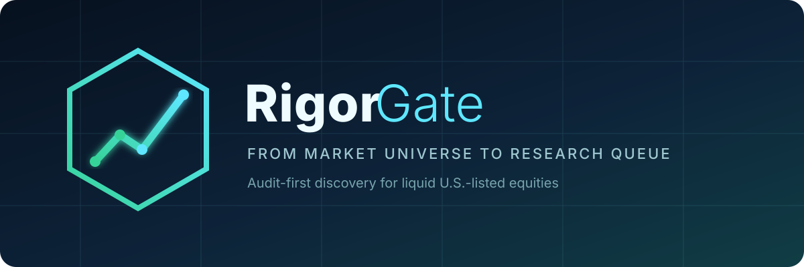
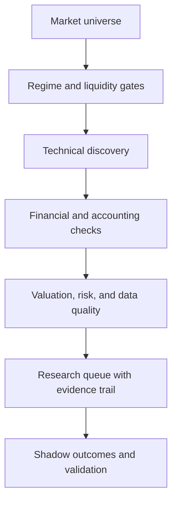

<p align="center">
  
</p>

<p align="center">
  <a href="https://github.com/Galionkh/galion-signal-forge/actions/workflows/ci.yml"></a>
  <a href="LICENSE"></a>
  
  
</p>

<p align="center"><strong>Open-source, audit-first U.S. equity research engine.</strong></p>

GALION SignalForge turns a broad equity universe into a small, inspectable research queue. It combines market regime, technical structure, fundamentals, valuation, data quality, accounting checks, and explicit risk gates. Every output preserves its evidence trail and states what the system could not verify.

It is designed to help researchers find candidates worth underwriting. It does not place orders, promise returns, or disguise a screening score as a probability of success.

## Why SignalForge?

- **Audit first:** every candidate carries source, freshness, coverage, and rejection details.
- **Fail closed:** missing critical evidence lowers confidence instead of inventing certainty.
- **Point-in-time aware:** the architecture separates discovery time from later outcomes.
- **No-key demo:** the full public project can be evaluated offline with deterministic synthetic data.
- **Modular providers:** prices, filings, macro data, and estimates remain replaceable.
- **Research posture:** outputs are `WATCHLIST`, `WAIT FOR PROOF`, or `RESEARCH CANDIDATE`—never automatic orders.

## Try it in 60 seconds

```bash
git clone https://github.com/Galionkh/galion-signal-forge.git
cd galion-signal-forge
python -m galion.demo
```

The demo uses fictional symbols and deterministic synthetic data. No API key, network access, or brokerage account is required.

## Architecture



| Layer | What it does | Typical public source |
|---|---|---|
| Universe | Filters U.S.-listed common stocks and tradability | Alpaca assets |
| Market data | Builds price, volume, breadth, stage, and momentum features | Alpaca IEX/SIP |
| Fundamentals | Normalizes income, balance-sheet, and cash-flow history | SEC XBRL, Alpha Vantage, optional FMP |
| Macro | Adds rates, inflation, and business-cycle context | FRED |
| Evidence | Records provenance, freshness, gaps, and provider fallbacks | Internal audit ledger |
| Validation | Tracks matured shadow outcomes without look-ahead | Point-in-time snapshots |

See [Architecture](docs/architecture.md), [Methodology](docs/methodology.md), and [Data Sources](docs/data-sources.md) for the design boundaries.

## Live research setup

1. Install Python 3.11 or later.
2. Copy the environment template:

   ```bash
   cp .env.example .env
   ```

3. Add your own provider credentials. Never commit `.env`.
4. Export the variables into your shell or secret manager.
5. Run:

   ```bash
   python run_scan.py --mode smoke
   python run_scan.py --mode full
   ```

Read the complete [Live Scan Guide](docs/live-scan.md) before treating output as research evidence. A public fork should keep credentials in GitHub Actions secrets and should not commit generated reports that contain proprietary or personal data.

## Install as a package

```bash
python -m pip install -e .
galion-demo
```

## Test

```bash
python -m compileall -q galion run_scan.py run_events.py
python -m unittest discover -s tests -v
```

CI runs the compile check, unit tests, and offline demo on Python 3.11 and 3.12. It uses no secrets and makes no live market-data request.

## Output postures

| Posture | Meaning |
|---|---|
| `WATCHLIST` | Interesting structure, but evidence or timing is incomplete |
| `WAIT FOR PROOF` | A specific missing confirmation prevents advancement |
| `RESEARCH CANDIDATE` | Strong enough for full human underwriting, not an order |
| `REJECTED` | A hard gate failed and the reasons are recorded |

Scores rank comparable candidates inside the current run. They are not calibrated win probabilities. Performance claims require enough matured, point-in-time observations; SignalForge defaults to withholding them until the validation sample is credible.

## Contributing

SignalForge welcomes improvements to provider adapters, point-in-time validation, accounting checks, documentation, and reproducible research. Start with [CONTRIBUTING.md](CONTRIBUTING.md), review the [roadmap](ROADMAP.md), and keep every pull request testable and source-aware.

Good first contributions include:

- provider contract tests with recorded fixtures;
- sector-specific accounting and valuation overlays;
- survivorship-bias and look-ahead-bias defenses;
- accessible dashboard improvements;
- reproducible research notebooks using fictional or redistributable data.

## Safety and legal

SignalForge is research software, not investment advice, a broker, or a fiduciary service. Markets involve risk, including loss of principal. Review [DISCLAIMER.md](DISCLAIMER.md) and [SECURITY.md](SECURITY.md). Never expose brokerage credentials or grant a research workflow permission to place orders.

Licensed under [Apache License 2.0](LICENSE). If this project supports your research, star it, test it, and help make the evidence trail harder to fool.
